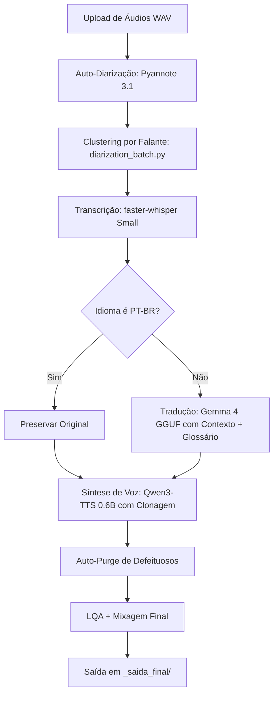
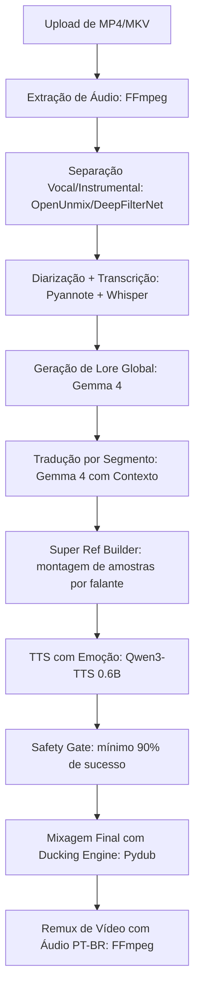
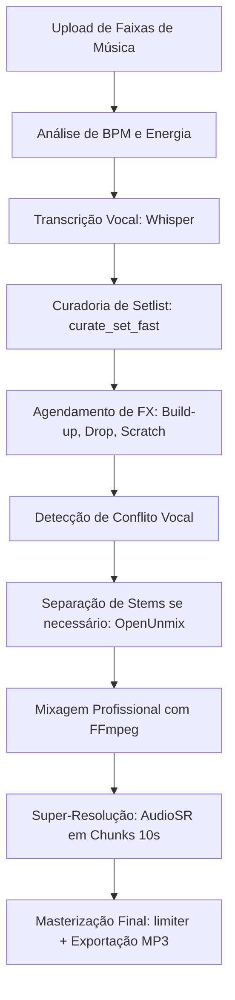

# 🤖 ARQUITETURA DO PROJETO — NarraVox Studios Premium

Este documento mapeia a estrutura real e completa do sistema **NarraVox Studios Premium Suite**, uma plataforma de dublagem, edição e criação de conteúdo com IA. Todos os módulos, pipelines, dependências e fluxos de responsabilidade estão documentados aqui com base no código-fonte real.

---

## 📦 Visão Geral do Sistema

O NarraVox é uma **suíte de aplicativos locais** composta por múltiplos motores Flask que rodam em portas dedicadas, todos gerenciados por um Hub Central (PyWebView). Cada motor é iniciado e encerrado sob demanda, compartilhando recursos de GPU de forma sequencial para não extrapolar o limite da VRAM da RTX 3050 (6GB).

```
nexus_app.py (Hub – Porta 5000)
├── nexus/dub/dubbing.py (Porta 5002) → Motor: Titan Games (CLI: 5002)
├── nexus/editor/narravox_editor.py    → Motor: Vortex Editor (Porta 5003)
├── nexus/dub/dubbing.py (Porta 5004) → Motor: Titan Video (CLI: 5004)
├── nexus/dj/vortex_dj.py              → Motor: Vortex DJ (Porta 5005)
└── nexus/docs/nexus_docs.py           → Motor: Documentação (Porta 5006)
```

---

## 📁 Estrutura de Módulos

### 🌐 Raiz do Nexus (`nexus/`)
| Arquivo | Responsabilidade |
|---|---|
| `nexus_app.py` | **Launcher Master (Hub Central)**. Gerencia o ciclo de vida de todos os motores. Serve o Hub na porta 5000 via PyWebView. Possui gerenciamento dinâmico de motores (start/stop/is_busy), streaming de mídia com suporte a Range Requests, limpeza de cache de projetos e auditoria de segurança de dependências. |
| `nexus_agent.py` | Lógica de agentes autônomos. |
| `nexus_local_forge.py` | Motor local do Forge. |

### 🧠 Core Engine (`nexus/core/`)
O cérebro do sistema. Contém todos os modelos de IA, utilitários e a lógica de orquestração dos pipelines.

#### 🎙️ Análise de Voz e Diarização
| Arquivo | Responsabilidade |
|---|---|
| `diarization.py` | **Diarização Consolidada**. Carrega o pipeline **Pyannote 3.1** na GPU/CUDA com fallback SpeechBrain para embeddings. Realiza a clusterização de áudios em lote por proximidade vocal (Speaker Diarization) e organiza as referências de vozes, além de cuidar do gerenciamento e purga de VRAM. Define o *ground truth* temporal dos segmentos. |

#### 📝 Transcrição e Tradução
| Arquivo | Responsabilidade |
|---|---|
| `whisper.py` | Transcrição de áudio com `faster-whisper` (modelo `small`). Contém o `Smart Trim` para cortar silêncios e alucinações. É invocado **sem `vad_filter`** para capturar toda a fala dentro de um segmento Pyannote. |
| `translation.py` | **Motor de Tradução Consolidado (Gemma 4 / Qwen 3.5)**. Roda a tradução em lote estruturada via llama-cpp-python (Turbo/Completions ou Chat/Fallback). Adapta silêncios e limita a velocidade a 16 CPS (caracteres por segundo) com speedup máximo de 35%. Conduz o LQA pós-tradução, termos de combate (DJ), sanitização e geração de Lore Global. |

#### 🧠 Gerenciamento de Modelos
| Arquivo | Responsabilidade |
|---|---|
| `model_loader.py` | **Gerenciador de Modelos de IA**. Controla o ciclo de vida de todos os modelos (Whisper, Gemma/Qwen, Qwen3-TTS). Implementa: detecção adaptativa de hardware (GPU/CPU), proteção de VRAM (limite de 5GB), unload/reload agressivo entre etapas, Lock global (`gema_lock`) para thread-safety e fallback via LM Studio (porta 1234). |

#### 🔧 Orquestradores
| Arquivo | Responsabilidade |
|---|---|
| `orchestrator_jobs_games.py` | **Orquestrador Titan (Jogos)**. Conduz o pipeline completo para áudios de jogos: Auto-Diarização → Transcrição → Tradução → TTS → LQA → Mixagem. Possui: Sistema de Retomada inteligente (resume), Auto-Purge de áudios defeituosos, Volume Boost por perfil, Perfis de Jogo personalizados, suporte a glossário do usuário e processamento paralelo thread-safe. |
| `orchestrator_jobs_core.py` | Orquestrador base de jobs gerais. |
| `orchestrator_routes.py` | Rotas de API do orquestrador. |

#### 🔊 Áudio e Síntese de Voz
| Arquivo | Responsabilidade |
|---|---|
| `tts.py` | Gerador de áudio usando **Qwen3-TTS-0.6B** na GPU (BFloat16 Ampere). Suporta: clonagem de voz via áudio de referência, injeção de emoção, limite de duração máxima, e modo Turbo via `FasterQwen3TTS` com CUDA Graphs. |
| `vocals.py` | Isolamento de voz e redução de ruído usando **DeepFilterNet** (ou OpenUnmix). Separa a faixa de vocais da trilha instrumental. |
| `utils.py` | **Utilitários Consolidados**. Junta as funções de sistema (UTF-8, prioridade de processos), manipulação física de áudio (FFmpeg, Pydub, aceleração, normalização, mixagem), telemetria (`set_progress` e estatísticas de progresso para `job_status.json`) e leitura/escrita atômica segura de JSON com file-locks para impedir corrupção (Phoenix Recovery). |

---

### 🎮 Módulo Titan Games (`nexus/dub/`)
Controla as rotas Flask e APIs dos módulos de Jogos e Vídeo.

| Arquivo | Responsabilidade |
|---|---|
| `dubbing.py` | **Motor Dubbing Consolidado (Porta 5002 / 5004)**. Une o servidor Titan Games e o Titan Video. Executa as APIs de upload e o pipeline unificado de vídeo: extração de áudio, stems, diarização, geração de Lore, tradução estruturada, TTS com Super Ref, mixagem de áudio com Ducking Engine e remux final por FFmpeg (RTX NVENC / Intel QQS). Aceita argumento dinâmico de porta CLI. |

---

### 🌪️ Vortex DJ (`nexus/dj/`)
Motor autônomo de mixagem de DJ com IA.

| Arquivo | Responsabilidade |
|---|---|
| `vortex_dj.py` | **Motor Vortex DJ Completo (Porta 5005)**. Classe `VortexDJ` com: análise de BPM/energia/espectro via `mixingbear`/FFmpeg, curadoria automática de setlist (`curate_set_fast`), detecção de conflito vocal (`_check_vocal_conflict`), separação de stems via OpenUnmix, agendamento automático de efeitos (Build-ups, Drops, Scratches, Stutter, Pulsar), **Super Mix** para transições épicas, sistema de checkpointing e resume de mixagem, Super-Resolução de Áudio via **AudioSR** em chunks de 10s com crossfade, e ACE Music Generation via servidor externo. |

---

### 🌪️ Vortex Editor (`nexus/editor/`)
Editor criativo de vídeo com VFX cinematográfico.

| Arquivo | Responsabilidade |
|---|---|
| `narravox_editor.py` | **Motor Vortex Editor (Porta 5003)**. Oferece: Parallax 3.5D para fotos (efeito "Ken Burns" com respiração orgânica), LUTs de cinema (HBO, Cyber Neon, Gotham Noir), corte acelerado por GPU (NVENC RTX), multi-corte em lote, junção de clipes em ordem numérica, geração de montagens Shorts/TikTok, legendas via Whisper, som de estúdio (OpenUnmix + DeepFilter) e análise de VFX sugerida via Gemma. |

---

### 🎬 Cine-Gen (`nexus/cine/`)
Motor de geração de cinema com IA generativa.

| Arquivo | Responsabilidade |
|---|---|
| `nexus_cine_gen.py` | **Motor Cine-Gen (Porta 5006 alternativa)**. Gera cenas de curta-metragem usando: Gemma 4 como "Diretor" para roteirizar em cenas técnicas JSON (Wan 2.2), motor de geração de vídeo Wan 2.2 5B GGUF (Q4_K_M), TangoFlux para SFX e trilha sonora, montagem com NVENC, AI Upscaling com Real-ESRGAN, e exportação vertical para Shorts/TikTok. Suporta IP-Lock de atores via fotos de referência. |

---

### 🧪 Nexus Godogen (`nexus_godogen/`)
Módulo paralelo de pipeline experimental com interface web própria.

| Arquivo | Responsabilidade |
|---|---|
| `nexus_godogen_server.py` | Servidor Flask do módulo Godogen. |
| `pipeline_engine.py` | Motor de pipeline de processamento do Godogen. |

---

## ⚙️ Dependências Tecnológicas

| Categoria | Tecnologia | Versão | Função |
|---|---|---|---|
| **Modelo de Linguagem** | `llama-cpp-python` | `0.3.23` Cu124 | Inferência local do Gemma 4 GGUF na RTX 3050 |
| **Transcrição (STT)** | `faster-whisper` | `1.2.1` | Transcrição de áudio (modelo `small`) |
| **Diarização/VAD** | `pyannote.audio` | `3.3.1` | Segmentação temporal por falante |
| **Geração de Voz (TTS)** | `qwen-tts` / `faster-qwen3-tts` | `≥0.0.1` | TTS com clonagem de voz (Qwen3-0.6B) |
| **Separação de Áudio** | `openunmix` | – | Isolamento vocal/instrumental |
| **Redução de Ruído** | `deepfilternet` | – | Filtragem de ruído de estúdio |
| **Super-Resolução de Áudio** | `audiosr` | – | Upscaling de áudio de 44kHz para 48kHz |
| **Processamento de Áudio** | `librosa`, `soundfile`, `pydub` | – | Análise, manipulação e conversão de áudio |
| **Backend de IA** | `torch`, `torchaudio` | Cu121 | Computação GPU via CUDA (RTX 3050) |
| **Análise de BPM** | `mixingbear` | – | BPM detection para o Vortex DJ |
| **Infraestrutura Web** | `Flask`, `Flask-Cors` | – | APIs internas de cada motor |
| **UI Desktop** | `pywebview` | – | Janela do Hub (WebView nativo do Windows) |
| **Análise de Performance** | `psutil` | – | Monitoramento de CPU/RAM |

---

## 🔁 Pipelines Principais

### Pipeline Titan — Jogos



### Pipeline Cinema — Vídeos



### Pipeline Vortex DJ



---

## 🖥️ Arquitetura de Hardware Alvo

| Componente | Especificação |
|---|---|
| GPU | NVIDIA RTX 3050 (6GB VRAM) |
| CPU | Intel i5-6400 (4 Cores, Skylake) |
| RAM | 16GB |
| VRAM Limite Seguro | 5.0 GB (hard limit no `ensure_vram_safety`) |
| TTS BFloat16 | Ampere nativo da RTX 3050 |

### Estratégia de Gerenciamento de VRAM
O sistema usa **Handoff Sequential** entre os modelos:
1. **Whisper** carrega → transcreve → **descarrega**
2. **Gemma 4** carrega → traduz → **descarrega**
3. **Qwen3-TTS** carrega → dubla → **descarrega**

Nenhum modelo fica ativo simultaneamente com outro de grande porte.

---

## 📝 Mapa de Arquivos por Módulo

| Módulo | Porta | Página HTML | Orquestrador |
|---|---|---|---|
| Hub Central | 5000 | `nexus_premium.html` | `nexus_app.py` |
| Titan Games | 5002 | `games_studio.html` | `orchestrator_jobs_games.py` |
| Vortex Editor | 5003 | `vortex_editor.html` | `narravox_editor.py` |
| Titan Video | 5004 | `video_studio.html` | `dubbing.py` |
| Vortex DJ | 5005 | `dj_studio.html` | `vortex_dj.py` |
| Documentação | 5006 | `nexus_docs.html` | `nexus_docs.py` |