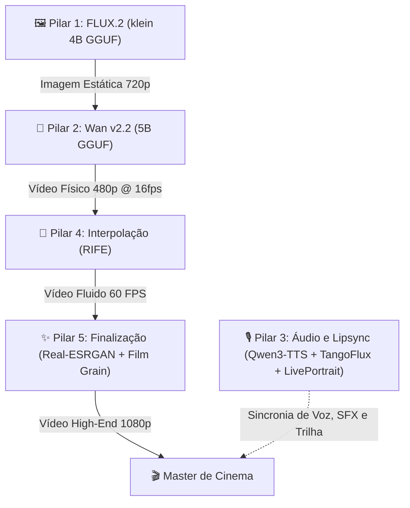

# 🎬 DOCUMENTO MASTER: PIPELINE GENERATIVO CINE-GEN
> **Manual de Engenharia e Arquitetura para IA de Vídeo na NVIDIA RTX 3050 (6GB VRAM)**

---

## 👁️ 1. Visão Geral do Projeto

O objetivo deste projeto é construir uma **Fábrica de Filmes Autônoma (Cine-Gen)** de alta ação de alta fidelidade visual, capaz de produzir micro-takes cinematográficos (de 1 a 5 segundos) rodando localmente em uma **GPU de entrada: NVIDIA RTX 3050 Laptop/Desktop com 6GB de VRAM**.

### O Grande Desafio das GPUs de 6GB
No sistema operacional Windows, cerca de **1.0 GB a 1.5 GB** da VRAM é consumido pela interface gráfica, navegador e processos de segundo plano. Isso nos deixa com uma **zona de segurança de ~4.5 GB a 4.8 GB de VRAM ativa**. 
Se o modelo de vídeo estourar esse limite por 1 MB sequer, o Windows ativará a memória compartilhada RAM (System Fallback), reduzindo a velocidade de geração em até **100x**. Portanto, este pipeline foi desenhado sob o dogma do **consumo cirúrgico de memória**.

---

## 📐 2. Arquitetura de Software Híbrida (A Estratégia dos 5 Pilares)

Para atingir qualidade de cinema sem travar o PC, dividimos o trabalho em cinco pilares especializados rodando em código Python nativo, usando cada IA no que ela faz de melhor:

### Pilar 1: FLUX.2 [klein] 4B & Slider Toolkit (A Base Fotorrealista Otimizada)
*   **Função:** Criar a imagem base do primeiro frame (Image-to-Video - I2V).
*   **Modelo Base:** **unsloth/FLUX.2-klein-4B-GGUF (versão Q4_K_M)**. Ocupa apenas ~2.0 GB de VRAM, rodando de forma 100% nativa na GPU em menos de 5 segundos.
*   **Controle de Qualidade (Sliders):** Integração do **NO8D/Slider-Toolkit-Klein4B** (LoRAs `skin`, `lighting` e `quality`). Esses controles são aplicados diretamente via script Python (através de pesos de LoRA ajustados dinamicamente no pipeline do Diffusers/GGUF), permitindo regular a textura da pele do ator (removendo o visual plástico de IA) e a iluminação dramática de estúdio de forma direta e programática.

### Pilar 2: Wan v2.2 5B (O Motor de Movimento)
*   **Função:** Animar a imagem estática.
*   **Otimização 6GB:** Usará o modo **I2V** com o modelo quantizado em **GGUF Q4** ou **NF4**, operando em resolução controlada (e.g., `480x270` a `720x480`). Todo o pipeline roda em Python nativo usando a biblioteca `diffusers` (carregando o UNet quantizado com offload sequencial de CPU).
*   **Acelerações SOTA (Velocidade Máxima):**
    *   **Distillation LoRA (Lightx2v):** Permite reduzir os passos de denoising do Wan 2.2 de 30 para apenas 4 a 8 passos, gerando vídeos 5x mais rápido sem perda de fidelidade.
    *   **TeaCache (Otimização Temporal):** Identifica e pula cálculos redundantes em frames de vídeo estáveis, poupando até 30% do poder de processamento da GPU.
    *   **SageAttention:** Otimiza o cálculo do Transformer do Wan via quantização matemática interna, reduzindo drasticamente o pico de VRAM.

### Pilar 3: Qwen3-TTS (CustomVoice) & TangoFlux (Voz, SFX e Trilha Sonora)
*   **Função:** Gerar as vozes dos personagens, efeitos sonoros ambientais, trilha musical e sincronizar os lábios do personagem.
*   **Voz Falada (Diálogos):** Utilização do **faster-qwen3-tts** rodando o modelo **Qwen3-TTS-12Hz-0.6B-CustomVoice**. 
    *   *Por que:* Esse motor otimiza a inferência nativa usando **CUDA Graphs**, alcançando velocidades de 2x a 6x superiores (sem a necessidade de frameworks pesados como Triton ou Flash Attention). O modelo *CustomVoice* fornece 9 timbres de vozes premium nativas de alta qualidade sem exigir clonagem externa, garantindo latência abaixo de 200ms na RTX 3050.
*   **Efeitos Sonoros (SFX) e Trilha Sonora (TangoFlux):** Utilização do **TangoFlux (515M)** via biblioteca Python nativa para gerar tanto os efeitos sonoros físicos (impactos, passos, vento) quanto as curtas trilhas sonoras e acordes de fundo (sintetizadores, piano cinemático). Ele elimina totalmente a necessidade do *ACE-Step 1.5* e do *Stable Audio Open*, unificando o pipeline de áudio mudo e reduzindo as trocas de modelos na VRAM.
*   **Sincronia Labial (LivePortrait):** Executado localmente via script Python nativo.
    *   **Aceleração Extrema (FasterLivePortrait + TensorRT):** Compilação do modelo para o formato **NVIDIA TensorRT (`.engine`)**, otimizando a execução diretamente nos Tensor Cores da RTX 3050. Isso acelera a renderização facial para **30+ FPS (tempo real)**, concluindo a sincronia labial em menos de 5 segundos e evitando o overhead/erros comuns do ONNX genérico.
    *   **Direcionamento Facial Inteligente (Face-Lock Routing):** Para cenas com múltiplos personagens na tela, o script Python executa uma etapa ultrarápida (milissegundos na CPU) de comparação de embeddings faciais (usando a foto de referência de cada ator contra as faces detectadas no vídeo). Ele mapeia o índice exato do rosto do personagem (ex: `Face 0` = Paulo, `Face 1` = Mãe) e instrui o LivePortrait a injetar a fala **exclusivamente na boca do ator correto**. Isso impede que o personagem errado ou ambos mexam a boca ao mesmo tempo, um erro comum em modelos comerciais de caixa-preta (como o VEO 3).

### Pilar 4: RIFE (O Suavizador Cinético)
*   **Função:** Transformar frames picotados em cinema ultra-fluido.
*   **Por que:** Em vez de gerar 60 frames na GPU pesada de vídeo, geramos apenas **16 frames (1 segundo)** e o RIFE interpola matematicamente os quadros intermediários para **60 FPS**. Economiza 75% de poder computacional.

### Pilar 5: Pós-Processamento & Saída HD/Full HD (A Maquiagem de Hollywood)
*   **Função:** Aplicar filtros ópticos, granulação de película e executar o upscale espacial obrigatório para HD/Full HD.
*   **Saída do Pipeline:** Como a simulação de movimento física roda em 480p para segurança de VRAM, o pilar de finalização utiliza o **Real-ESRGAN_x2plus** em precisão FP16 para ampliar o vídeo para **720p (HD)** ou **1080p (Full HD)** de forma ultrarrápida, garantindo que o teaser final exportado seja entregue em alta definição cristalina para o usuário.

---

## 🎨 3. Pós-Processamento Anti-AI Look (O Segredo do Fotorrealismo)

Para eliminar completamente o aspecto artificial de "massinha de modelar" (waxy look) gerado por modelos de poucos parâmetros e upscales simples, aplicamos três filtros de estúdio pós-renderização:

### A. Injeção de Grão de Película Cinematográfica (Film Grain)
*   **O Problema:** IAs geram gradientes de cores matematicamente lisos e perfeitos, o que grita "IA" para o cérebro humano.
*   **A Solução:** Injetamos uma camada sutil de ruído/grão analógico em movimento de película de 35mm (Kodak) via FFmpeg sobre o vídeo.
*   **O Efeito:** O cérebro associa o grão sutil a uma produção cinematográfica profissional (estilo Arri Alexa), quebrando os gradientes artificiais e disfarçando micro-desfoques de movimento de forma orgânica.

### B. Otimização Cromática e Óptica de Lente Real
As câmeras físicas reais possuem falhas ópticas que a IA não gera por padrão. Injetamos essas falhas sutis de lente:
*   **Aberração Cromática:** Um deslocamento microscópico de 1 a 2 pixels nos canais de cores (Vermelho e Azul) nas bordas da tela, imitando a dispersão de luz de lentes de vidro reais.
*   **Nitidez Inteligente (Unsharp Mask):** Um filtro de nitidez localizado focado nas arestas e contrastes médios (poros da pele, contornos), evitando a criação de halos brancos artificiais nas bordas.
*   **Vinheta Cinematográfica (Vignette):** Um leve escurecimento orgânico e gradual nas bordas da tela, focando o olhar na ação central.

### C. Upscale Generativo Espacial Controlado
Em vez de esticar pixels de forma linear (o que borra a imagem), o pipeline faz o upscale em duas opções de acordo com a cena:
1.  **Upscale Matemático Inteligente:** Real-ESRGAN (rápido e leve).
2.  **Refinamento Generativo (Tile):** Um modelo de difusão de baixa força de denoise (0.15) desenha micro-texturas reais (veios de madeira, poros da pele) sobre os pixels ampliados, sem alterar a física do movimento.

---

## ⚡ 3. O Mecanismo de Dupla Rota (Otimização Dinâmica de VRAM & Produção)

Para equilibrar fotorrealismo extremo e física precisa sem estourar o limite de VRAM de 5 GB utilizáveis na GPU de 6GB, o motor opera em duas rotas dinâmicas selecionadas automaticamente via tags JSON geradas pelo Diretor Gemma:

### ROTA A: O Pipeline Unificado (Só FLUX.2 [klein] 4B + Motion LoRA)
*   **Aplicação:** Ideal para 90% das cenas do filme (diálogos, movimentos de câmera como pans/zooms, atuação lenta e ambientações/B-Roll).
*   **Como funciona:** O **FLUX.2 [klein] 4B GGUF (Q4_K_M)** é carregado na GPU. Ele gera os 24 frames nativos de 720p diretamente em uma única passada de difusão, aplicando em tempo real a calibragem dos sliders de iluminação e pele do **NO8D/Slider-Toolkit**.
*   **Benefício:** Velocidade incrível, zero troca de modelos na VRAM (sem swap) e qualidade visual ajustada de forma cirúrgica.

### ROTA B: O Pipeline Híbrido Sequencial (Wan 2.2 + FLUX.2 [klein] 4B)
*   **Aplicação:** Cenas de física extrema, colisões ou quebra de matéria.
*   **Como funciona:** Executa o ciclo de revezamento de VRAM:
    1.  Carrega o **Wan 2.2 (GGUF Q4_K_M)** ➔ Simula a física real de movimento a 480p ➔ Salva os frames brutos em PNG ➔ Descarrega o Wan da VRAM.
    2.  Carrega o **FLUX.2 [klein] 4B GGUF (Q4_K_M)** + sliders do **Slider-Toolkit** ➔ Refina, redesenha as texturas de pele/materiais e aplica iluminação dramática sobre a física gerada pelo Wan ➔ Salva a cena final.
*   **Benefício:** Simulação perfeita de física tridimensional com acabamento fotorrealista e texturas controláveis sem estourar a VRAM.

---

## 🔒 4. O Sistema de Quádruplo Bloqueio de Distorção (Anatomia e Consistência Real)

Nas cenas de ação rápida, aplicamos quatro filtros de segurança matemáticos e estratégias de corte executados de forma 100% invisível por dentro do código Python e guiados pelo Diretor Gemma para garantir que a anatomia humana, mãos e objetos nunca sofram mutações digitais:

### Bloqueio 1: A Jaula Esquelética (OpenPose + MediaPipe Hands)
*   **O Problema:** IAs de vídeo tendem a deformar braços e desenhar mãos com 6 dedos em movimentos rápidos.
*   **A Solução:** O backend extrai uma malha geométrica de controle:
    *   **OpenPose:** Trava os 18 principais pontos de articulação do corpo (impedindo cotovelos e ombros de dobrarem ao contrário).
    *   **MediaPipe:** Mapeia 21 pontos tridimensionais em cada mão, obrigando a IA a gerar exatamente 5 dedos posicionados sobre a malha rígida, erradicando dedos extras.

### Bloqueio 2: O Limite de Denoise Estrito (0.15 - 0.20)
*   **A Solução:** Durante a fase de redesenho pelo FLUX no upscale dos frames do Wan, o parâmetro `denoising_strength` é travado em **0.15**.
*   **O Efeito:** O FLUX é matematicamente proibido de alterar mais de 15% dos pixels originais do movimento. Ele só adiciona texturas nítidas e luz, mantendo a geometria da faca e do corpo 100% livre de mutações ou deformações.

### Bloqueio 3: Desfoque de Velocidade Direcional (Cinematic Motion Blur)
*   **O Problema:** IAs geram movimentos rápidos com nitidez artificial estática, o que revela imperfeições de pixels.
*   **A Solução:** O programa analisa o Fluxo Óptico (Optical Flow) e aplica um desfoque direcional nas partes do corpo de alta velocidade (como a mão socando ou a faca descendo).
*   **O Efeito:** Simula perfeitamente o ângulo do obturador de 180° de câmeras de cinema reais (ex: Arri Alexa), camuflando imperfeições e dando uma fluidez orgânica fantástica à ação.

### Bloqueio 4: A Regra de Ouro dos Shots Curtos (2s a 3s)
*   **O Problema:** A atenção temporal dos modelos de vídeo (DiTs) se degrada e gera entropia após os primeiros segundos, causando mutações de membros e fusão de rostos.
*   **A Solução:** O Diretor Gemma divide rigidamente as cenas em tomadas curtíssimas de **2 a 3 segundos**. Para cenas de combate e colisão de alta velocidade (socos, cortes, impactos), a duração é travada em estritamente **2 segundos**.
*   **O Efeito:** Cortamos a geração *antes* que a IA tenha tempo físico de acumular erros matemáticos e deformar a anatomia. Esteticamente, isso cria uma montagem de ação dinâmica com ritmo frenético de cinema hollywoodiano real!

---

## ⚡ 6. Hacks de Engenharia de VRAM (Como rodar 5B em 6GB)

Estas são os truques de engenharia que o nosso motor [nexus_cine_gen.py](file:///c:/IA_dublagem/nexus_cine_gen.py) aplicará para manter o consumo abaixo dos 4.8 GB reais de VRAM:

### 🚀 Hack #1: Pré-Cálculo de Embeddings de Texto (CPU Offload)
O codificador de texto usado por modelos modernos (T5-XXL) consome sozinho quase **5 GB de VRAM** em FP16. Se ele for carregado na GPU junto com o modelo de vídeo, o sistema trava.
*   **A Solução:** Carregamos o T5 na memória RAM do computador (CPU). Ele gera os tensores de texto (embeddings) a partir do prompt e, em seguida, **o T5 é completamente deletado da memória**. Apenas os embeddings compactos (`tensors.pt`) são enviados para a GPU.
*   **Economia de VRAM:** **~4.5 GB livres na GPU** antes mesmo do modelo de vídeo carregar.

### 🚀 Hack #2: VAE Tiling & VAE Slicing
A decodificação do vídeo latente para frames pixels pelo VAE costuma gerar picos massivos de VRAM na GPU.
*   **A Solução:** Ativamos `vae.enable_tiling()` e `vae.enable_slicing()`. O vídeo é decodificado em pequenos pedaços espaciais e temporais sequenciais, eliminando o estouro de memória no final da renderização.

### 🚀 Hack #3: Sequential CPU Offload
*   **A Solução:** Ativamos `pipe.enable_sequential_cpu_offload()`. Isso move cada subcamada do Transformer de vídeo para o computador e as traz para a GPU apenas no milissegundo exato do cálculo do passo de denoising, ejetando-as logo em seguida.

### 🚀 Hack #4: Revezamento Sequencial de Modelos (Model Swap)
*   **A Solução:** Execução sequencial estrita de inferência e limpeza de cache da GPU. O pipeline descarrega completamente os modelos anteriores da VRAM antes de carregar o próximo na GPU (ex: descarrega o LLM Gemma antes de carregar o Wan 2.2; descarrega o Wan 2.2 antes de carregar o TangoFlux e o LivePortrait). 
*   **Efeito:** O consumo de VRAM ativa em qualquer milissegundo do pipeline nunca excede o limite físico seguro de **4.5 GB**, eliminando travamentos por paginação PCIe no Windows.

---

## 🎬 7. Diretrizes de Prompts para o Diretor Gemma (Modo Ultra-Strict)

O modelo Gemma 4 (Diretor) operando no [nexus_cine_gen.py](file:///c:/IA_dublagem/nexus_cine_gen.py) deve seguir um conjunto de diretrizes rígidas para evitar alucinações físicas nas cenas rápidas:

1.  **Balanço de Movimento:** Sempre usar `consistent shutter speed` (velocidade de obturador consistente) e `locked-off camera` (câmera estática em tripé) se o personagem estiver correndo ou pulando muito rápido. Isso impede que a tela vire uma sopa de pixels.
2.  **Tratamento de Mudança de Matéria:** Cenas complexas (cortar algo, quebrar um vidro) devem ser divididas em micro-takes rápidos através de cortes de montagem (Ex: Faca encosta -> Flash de ação rápida -> Metades caindo).
3.  **Foco em Detalhes Cinemáticos:** Injetar partículas suspensas (`floating dust particles`, `cinematic haze`, `lens flare`) para dar profundidade e esconder pequenas alucinações do modelo de 5B nos planos de fundo.

---

## 📅 8. O Fluxo de Trabalho do Usuário (Interface Cine-Gen)

1.  **Casting:** O usuário carrega as fotos de referência dos atores na UI.
2.  **Script:** Digita o roteiro no console.
3.  **Planejamento:** O Diretor Gemma divide o roteiro em JSON (rotulando-as automaticamente como ROTA A ou ROTA B).
4.  **Limpeza Termal (0.5s):** Entre cada take, a GPU recebe uma micro-pausa térmica de meio segundo para evitar ciclos de superaquecimento na RTX 3050 Laptop.
5.  **Compilação:** O FFmpeg junta as cenas no formato 9:16 (Shorts/TikTok) ou 16:9 usando aceleração de hardware **NVIDIA NVENC** (super rápido).

## 🛡️ 9. Arquitetura de Agentes Rígidos (Anti-Hallucination Guard)

Para garantir estabilidade absoluta e evitar que a LLM (Gemma) invente parâmetros inexistentes e quebre a execução do pipeline Python, o sistema opera sob uma **arquitetura de agentes rígidos com enums fechados**:

### A. O Papel do Gemma (O Agente Mapeador)
*   O Gemma não tem liberdade para escrever comandos em texto aberto. Ele atua estritamente como um classificador que escolhe opções de listas fechadas (Enums) pré-definidas no prompt de sistema:
    *   `voz_emocao`: Restrito a `["NORMAL", "WHISPER", "ANGRY", "PANIC", "SAD"]`.
    *   `color_grading`: Restrito a `["natural", "neon_noir", "warm_sepia", "cool_blue"]`.
    *   `camera_movement`: Restrito a `["static", "zoom_in", "pan_left", "pan_right", "tilt_up"]`.

### B. O Papel do Python (O Validador e Executor)
*   **Schema Validation:** O script Python lê o JSON gerado pelo Gemma e valida cada chave. Se o Gemma tentar alucinar ou criar um valor fora das listas autorizadas, o script Python intercepta e força um valor padrão seguro (Fallback) de forma 100% silenciosa.
*   **Mapeamento Determinístico:** O script traduz as tags enums em parâmetros físicos reais. Por exemplo, se receber `"color_grading": "cool_blue"`, o Python executa um comando FFmpeg determinístico com a matriz de cor azulada exata, sem dar margem para a IA alucinar no código de edição.

---
> [!IMPORTANT]
> **Status de Viabilidade:** 
> Com a estratégia de Pré-cálculo do T5 em CPU + Quantização GGUF/NF4 + VAE Tiling + Dupla Rota Otimizada + Validação de Agentes Rígidos, a geração de micro-takes de alto fotorrealismo é **totalmente viável, segura e livre de travamentos** na RTX 3050 de 6GB, com tempo médio estimado de **50 a 65 segundos por tomada**.

---
*Documento universal homologado para o ecossistema **NEXUS CINE-GEN (v2026.DIRECTOR)***.
