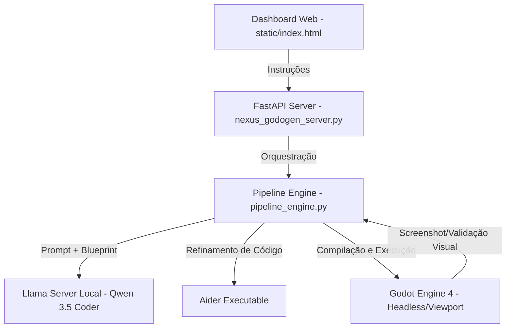

# 🎮 GodoGen Nexus Hub

O **GodoGen Nexus** é uma suíte de criação de jogos assistida por inteligência artificial, focada em extrema acessibilidade, baixa curva de aprendizado e execução 100% local. Através de uma interface web minimalista, o criador conversa com os agentes de IA, que programam, organizam os arquivos e compilam cenários automaticamente na **Godot Engine 4**.

> [!NOTE]
> Este projeto é construído a partir do motor open-source **Godogen** de Alex Ermolov (sob a Licença MIT), adicionando uma camada robusta de servidor local, interface gráfica unificada, controle avançado de integridade de código com **Aider** e gerenciamento inteligente de hardware para GPUs de entrada.

---

## 🌟 Recursos Principais

### 💬 Criação Conversacional (Zero Código para o Usuário)
Você não precisa aprender a interface complexa da Godot ou sintaxe de GDScript. O desenvolvimento ocorre como uma conversa: você descreve o que quer no jogo, testa o resultado e pede ajustes. A IA assume o papel de programadora do projeto.

### 🤖 Integração Avançada com Aider & Qwen
Diferente de geradores de código comuns que cometem erros simples de sintaxe, o GodoGen Nexus utiliza o **Aider** acoplado ao modelo local **Qwen 3.5 Coder**. Essa dupla atua refinando, corrigindo colisões, ajustando imports de nós e polindo a lógica dos scripts gerados para garantir que o jogo sempre compile perfeitamente no Godot 4.

### 🧠 Gerenciamento de Contexto Inteligente (Game Blueprints)
Para evitar que a IA se confunda em projetos grandes, o Nexus cria um arquivo dinâmico chamado `game_blueprint.md` na pasta do jogo. Ele serve como o "mapa" e resumo do projeto, contendo as metas atuais, variáveis globais (ex: força do pulo, vida) e arquivos gerados. Isso reduz a carga de dados enviada à GPU, mantendo o contexto sob o limite de **16.384 tokens**.

### ⚡ Otimização de VRAM (Target: RTX 3050 6GB)
O Nexus foi projetado para rodar localmente sem travar o seu computador:
- **Context Shift Dinâmico**: Ao abrir o editor do Godot ou iniciar um playtest, o Nexus descarrega temporariamente o modelo de IA local da placa de vídeo para liberar 100% da VRAM.
- **Auto-Reload**: No momento em que você fecha a janela do jogo, o Nexus recarrega a IA na GPU de forma automática em menos de 2 segundos, pronta para continuar desenvolvendo.
- **Flash Attention Habilitado**: Reduz o peso do KV Cache na VRAM pela metade.

---

## 🛠️ Arquitetura do System

O projeto é dividido em módulos simples e eficientes:

---

## 📄 Créditos e Licença

- **Motor Base**: [Godogen](https://github.com/alex-ermolov/godogen) criado por **Alex Ermolov** (Licenciado sob a Licença MIT).
- **Customização e Interface Nexus**: Desenvolvido por Paulo Henrik (NarraVox Studios) com foco em democratizar o acesso ao desenvolvimento de jogos locais.
- **Licenciamento**: Este wrapper e modificações adicionais continuam sob a licença permissiva MIT.
